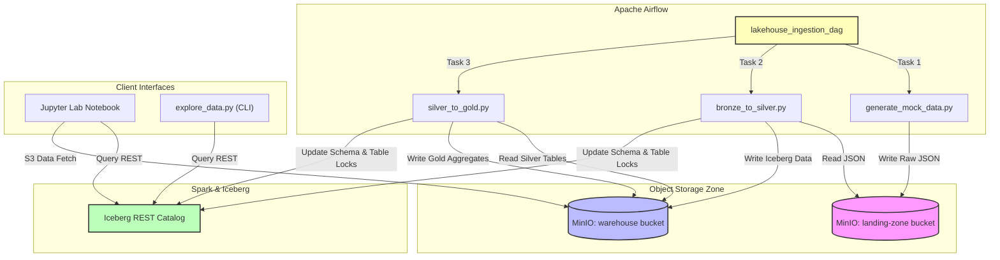

# 🌊 E-Commerce Data Lakehouse Ingestion & Transformation Pipeline

A production-grade, local Data Lakehouse platform built on a containerized architecture. This project serves as the foundation for modern data engineering workloads—incorporating raw ingestion landing, transactional tables (ACID) on object storage, distributed compute, metadata catalog tracking, data quality enforcement, and workflow orchestration.

---

## 🎯 Project Goals & Objectives

1. **Implement a Medallion Architecture**: Demonstrate a clean flow of data from raw unstructured/semi-structured files (Bronze) to structured and conformed tables (Silver), up to aggregated analytical views (Gold).
2. **ACID Transactions on Object Storage**: Leverage **Apache Iceberg** as the open table format on top of **MinIO** to provide ACID transactions, time travel, schema evolution, and partition layout changes.
3. **Decoupled Catalog Management**: Utilize a standalone **Iceberg REST Catalog** to manage table metadata independently of Spark compute nodes, enabling concurrent access.
4. **End-to-End Orchestration**: Schedule and backfill daily data runs using **Apache Airflow**, demonstrating how execution dates (`{{ ds }}`) partition and process incremental transaction files.
5. **Compute at Scale**: Configure **Apache Spark (PySpark)** to perform transformations (cleansing, typecasting, SQL MERGE operations, and aggregations) with optimized S3 file interactions.
6. **Infrastructure Foundation for Future Phases**: Position the repository for future expansions, including external API data harvesting, Data Version Control (DVC) tracking for machine learning workflows, and advanced feature engineering pipelines.

---

## 🏗️ Architectural Blueprint

The pipeline is coordinated and executed entirely within Docker containers:



---

## 📦 Medallion Storage Design

This repository maps the landing zone and warehouse storage layers inside MinIO as follows:

### 1. Bronze Layer (`landing-zone` bucket)
- **Purpose**: Serves as the landing zone for raw, immutable snapshots of dimensional catalogs and daily transactional streams.
- **Layout**:
  - `customers/customers.json`: Snapshot of customer profiles with SCD updates.
  - `products/products.json`: Snapshot of product catalogs (pricing and stock updates).
  - `orders/year=YYYY/month=MM/day=DD/orders.json`: Daily transaction logs.
  - `order_items/year=YYYY/month=MM/day=DD/order_items.json`: Daily order items breakdown.

### 2. Silver Layer (`warehouse` bucket)
- **Purpose**: Cleansed, schema-enforced, and deduplicated tables stored in Apache Iceberg format.
- **Iceberg Tables (`demo.db.*`)**:
  - `demo.db.customers`: Conformed customer profiles with transaction history.
  - `demo.db.products`: Cleaned inventory and pricing.
  - `demo.db.orders`: Partitioned by day using Iceberg's native `days(order_date)` hidden partitioning.
  - `demo.db.order_items`: Granular order items linked to order IDs.
- **Merge Logic**: Updates are processed via SQL `MERGE INTO` queries, enabling upserts for changed customer records and order statuses.

### 3. Gold Layer (`warehouse` bucket)
- **Purpose**: Cleaned, business-level aggregates designed for analytical reporting, business intelligence dashboards, and machine learning feature stores.
- **Iceberg Tables (`demo.db.*`)**:
  - `demo.db.gold_daily_sales`: Aggregates total revenue, order count, average order value, and cancel counts per date.
  - `demo.db.gold_customer_metrics`: Customer lifetime value (LTV), total purchase count, and signup recency.
  - `demo.db.gold_category_performance`: Sales breakdown and unit volumes sold per product category.

---

## ⚙️ Container Port Configurations

All containers run inside the `lakehouse-net` Docker network. Port mapping is configured as:

| Service | Host Port | Target Port | UI/API Endpoint |
| :--- | :--- | :--- | :--- |
| **Airflow Webserver** | `8080` | `8080` | [http://localhost:8080](http://localhost:8080) (Credentials: `admin`/`admin`) |
| **Spark Master / Jupyter** | `8888` | `8888` | [http://localhost:8888](http://localhost:8888) (Jupyter Notebook Console) |
| **MinIO API Console** | `9001` | `9001` | [http://localhost:9001](http://localhost:9001) (Credentials: `admin`/`supersecretpassword`) |
| **MinIO S3 API** | `9000` | `9000` | S3 clients connection endpoint |
| **Iceberg REST Catalog** | `8181` | `8181` | [http://localhost:8181/v1/config](http://localhost:8181/v1/config) |

---

## 🚀 Getting Started & Setup

### 1. Host Verification Environment
Prepare the host machine environment to run checking scripts. Since Apache Airflow and PySpark run containerized, install only the S3 communication client and request helpers on the host:
```bash
pip install boto3==1.34.50 requests==2.31.0
```

### 2. Launch Infrastructure
Start the database, object storage, REST catalog, Spark worker, and Airflow orchestration engine:
```bash
docker compose -f docker/docker-compose.yml up -d
```

### 3. Run Verification Tests
Assert that the local services are healthy and that the MinIO Client has initialized the `landing-zone` and `warehouse` buckets:
```bash
python verify_infra.py
```

---

## 📅 Orchestration Flow & Incremental Runs

The Apache Airflow DAG (`lakehouse_ingestion_pipeline`) runs on a daily schedule starting from `2026-06-10`. Since `catchup=True` is enabled:
1. Airflow backfills the execution history sequentially.
2. For each day, `generate_mock_data.py` generates order and catalog streams for that execution date, uploading them as JSON lines into target landing paths.
3. Next, `bronze_to_silver.py` reads the daily partition, runs data quality cleanups, and merges the records into Iceberg tables.
4. Lastly, `silver_to_gold.py` updates the analytical data marts based on the updated transactions.

---

## 🔍 Data Exploration

### Command-Line Summary
To view table schemas, row counts, and execute sample SQL analytical queries across conformed tables, run the custom CLI explorer:
```bash
docker exec -it lakehouse-spark-master python /home/jovyan/src/explore_data.py
```

### Jupyter Interactive Notebooks
Navigate to [http://localhost:8888](http://localhost:8888) in your browser. All required catalog configurations are pre-loaded in the container environment. You can instantiate a Spark Session in Python and query the tables immediately:
```python
from pyspark.sql import SparkSession
spark = SparkSession.builder.getOrCreate()

# Query daily gold metrics
spark.sql("SELECT * FROM demo.db.gold_daily_sales ORDER BY order_date DESC").show()
```
