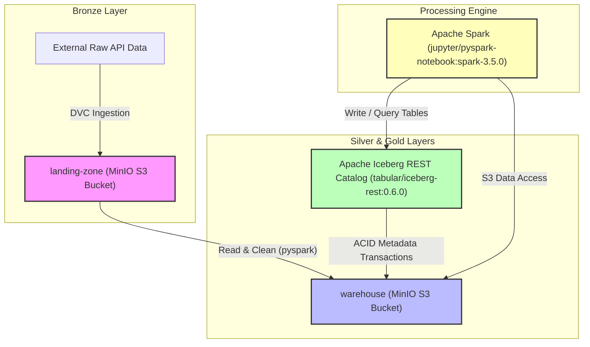

# 🌊 Lakehouse Ingestion Pipeline (Phase 1: Platform Foundation)

This repository hosts the platform foundation for a local, production-style Data Lakehouse. Running on Windows 11 / WSL2 via Docker, it integrates object storage, transactional table catalogs, and distributed compute, laying the groundwork for raw API ingestion, data version control (DVC), Spark transformations, Airflow orchestration, and future ML/Feature Engineering workloads.

---

## 🗺️ System Architecture

The following diagram illustrates the flow of raw data to processed tables and metadata catalogs:



---

## 🛠️ Service Descriptions

1. **MinIO Object Store**: A high-performance, S3-compatible object storage server. MinIO hosts the physical directories for raw landing data and managed Iceberg data files.
2. **Apache Iceberg REST Catalog**: The official metadata management interface using the Iceberg REST protocol. It coordinates transaction commits, table schema locks, and snapshot lifecycle details, decoupled from Spark compute.
3. **Apache Spark**: Distributed query engine configured with the native Iceberg Spark extensions and AWS S3 FileIO plugins to execute parallel data pipelines and transformations.

---

## 📦 Storage Medallion Architecture

- **`landing-zone` Bucket (Bronze Layer)**:
  - Stores raw, immutable API response snapshots and files (e.g., `/weather`, `/crypto`).
  - Tracked via Data Version Control (DVC) for auditability.
- **`warehouse` Bucket (Silver + Gold Layer)**:
  - **Silver Layer**: Cleansed, conformed, and typed datasets stored in Iceberg tables.
  - **Gold Layer**: Feature stores, business analytics, and aggregated data marts formatted as queryable Iceberg tables.

---

## 🔌 Port Mappings

| Service | Port | Description |
| :--- | :--- | :--- |
| **MinIO API** | `9000` | S3-compatible client API endpoint |
| **MinIO UI** | `9001` | Object browser web interface |
| **Iceberg REST** | `8181` | Catalog management API endpoint |
| **Spark UI / Jupyter** | `8080` / `8888` | Spark cluster master UI / Notebook environment |

---

## 🚀 Setup Instructions

### 1. Install Local Dependencies
Set up your python environment and install the pinned requirement libraries:
```bash
pip install -r requirements.txt
```

### 2. Start the Infrastructure
Launch all local storage, catalog, and compute services using Docker Compose:
```bash
docker compose -f docker/docker-compose.yml up -d
```

### 3. Run Infrastructure Verification
Run the verification script to assert catalog availability, MinIO API responsiveness, and default bucket creation:
```bash
python verify_infra.py
```

---

## 📋 Expected Verification Output

When the foundation starts up successfully, running the verification script prints the following console trace:

```text
==================================================
RUNNING PLATFORM FOUNDATION VERIFICATION (PHASE 1)
==================================================
[2026-06-15 21:00:00] INFO [verify_infra:10] Starting verification of Iceberg REST Catalog...
[2026-06-15 21:00:00] INFO [verify_infra:15] 🟢 SUCCESS: Iceberg REST Catalog responded with HTTP 200.
[2026-06-15 21:00:00] INFO [verify_infra:28] Starting verification of MinIO connection and buckets...
[2026-06-15 21:00:01] INFO [verify_infra:41] Connected to MinIO. Found buckets: ['landing-zone', 'warehouse']
[2026-06-15 21:00:01] INFO [verify_infra:46] 🟢 SUCCESS: Verified presence of buckets: ['landing-zone', 'warehouse']
==================================================
[2026-06-15 21:00:01] INFO [verify_infra:57] 🟢 SUCCESS: Platform foundation environment is fully healthy!
```
